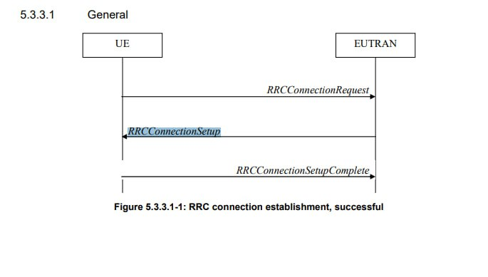

# HTPhomework
## Задача:
В данной задаче нужно написать клиента, который будет устанавливать RRC соединение, и сервер, который будет ему отвечать.
1. Собрать RRC Connection Setup Request и отправить ее на интерфейс
2. Принять RRC Connection Setup Request
3. Обработать и разобрать
4. Сформировать RRC Connection Setup Complete и отправить на интерфейс

## manual
### asn1c 
install ```git clone https://github.com/vlm/asn1c```    
check INSTALL.md REQUIREMENTS.md
### server
    cd Server
    make
    make start
### client 
    cd Client
    make
    make start
## realization


    